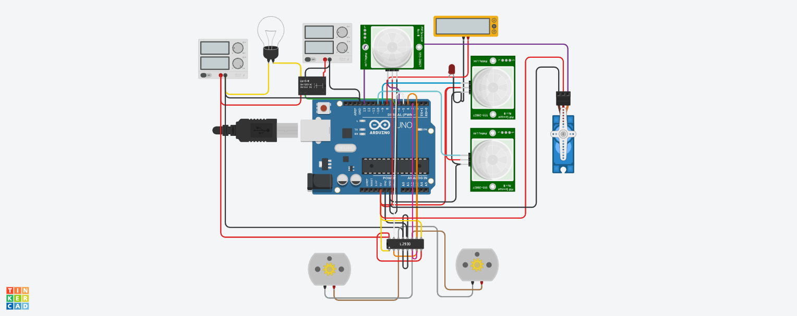

# Line Follower Robot with Bluetooth Control

## Overview

This project implements a line-following robot controlled by an Arduino. The robot utilizes two IR sensors for line detection and can navigate autonomously. It includes a Bluetooth module (HC-05) for remote control and a servo motor that reacts when the robot reaches the end of the line.

### Author: Antony Juza

## Features

- **Line Following**: The robot follows a predefined line using IR sensors.
- **Bluetooth Control**: Commands can be sent via a mobile app to control the robot's movements.
- **Servo Motor Activation**: When the robot reaches the end of the line, a servo motor moves to 90 degrees and waits before returning to 0 degrees.
- **LED Indicator**: An LED blinks to indicate the robot's operational status.

## Hardware Requirements

- Arduino Uno
- L298N Motor Driver
- HC-05 Bluetooth Module
- 2 IR Sensors
- Servo Motor
- Chassis for the robot
- Power supply (batteries)

## Circuit Diagram


For a detailed circuit diagram, visit: [Circuit Diagram Link](https://www.tinkercad.com/things/i6LlTWV21L8-aadhi-project-ckt?sharecode=nKdkUjUxs9OYDsy3M79F352fQ4dGYsdn1EHI2Xtks2A)
## Connections

| Component             | Arduino Pin |
|-----------------------|-------------|
| IN1                   | 2           |
| IN2                   | 3           |
| IN3                   | 4           |
| IN4                   | 5           |
| RELAY_PIN             | 7           |
| IR_SENSOR_LEFT_PIN    | 8           |
| IR_SENSOR_RIGHT_PIN   | 9           |
| LED_PIN               | 10          |
| HC-05 RX              | 11          |
| HC-05 TX              | 12          |
| Servo Signal Pin      | 11          |

## Installation

1. Clone the repository:
   ```bash
   git clone https://github.com/Antony-makemybot/Aadhi_Project.git
